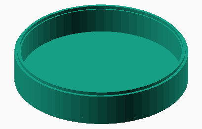
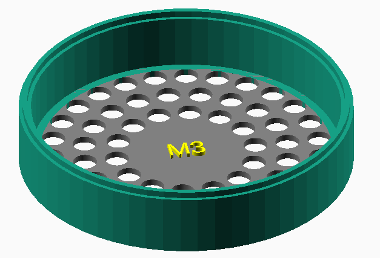
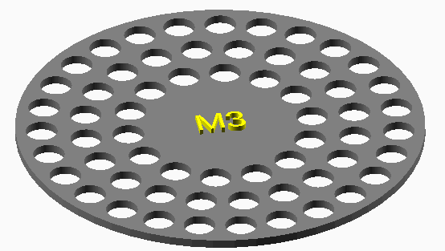
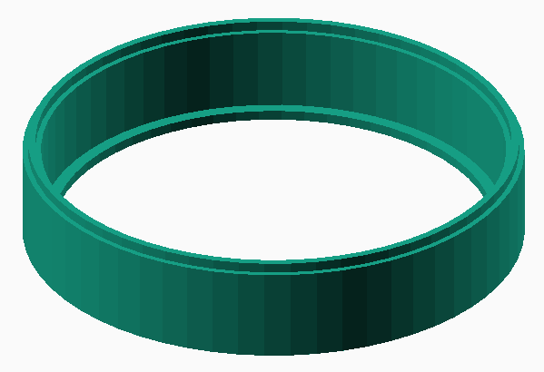
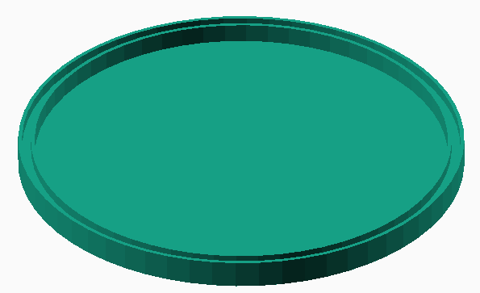
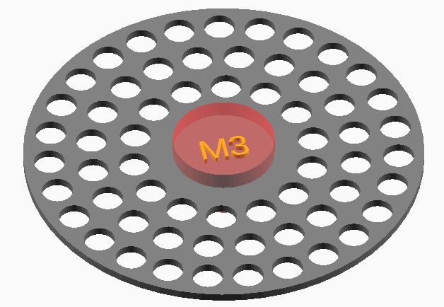
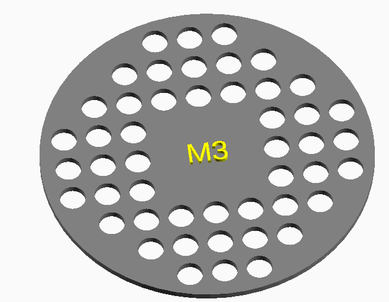

# Hex nut sorter V2

A device for easily sorting hex nuts

Featured on [Hackaday](https://hackaday.com/2022/10/13/3d-printed-sorter-separates-spare-hex-nuts-with-a-shake/)! (Didn't see that coming! Thank you [@Donald Papp](https://hackaday.com/author/dp2cnk/))

***
## Contents
 - [Resources](#resources) 
 - [Customization (Openscad variables)](#customization) 
 - [Open Scan Command Line](#command-line) 

***
## Resources
- [Printables](https://www.printables.com/model/289739-hex-nut-sorter-v2-metric-and-standard) model page.

- [GitHub](https://github.com/jonafriendj/nut-sorter)

- YouTube demo of sorting multiple sizes at once   [https://youtu.be/DMcDOK0mIe8](https://youtu.be/DMcDOK0mIe8)

- YouTube demo of sorting one size at a time (less printing) [https://youtu.be/55GoIIsHnp8](https://youtu.be/55GoIIsHnp8)

- [OpenScad](https://openscad.org/downloads.html) download page

- Browser Based scad https://openscad.cloud/openscad/
***
## Customization
- Object Type
    - Model Part
        - Bottom cup (**Default**)
        
        - Sorting plate attached to cup
        
        - Sorting plate
        
        - Sorting cup
        
        - Lid
        
- Printer
    - Tolerance
        - (Default .2)
- Global settings
    - Wall thickness
        - As measured from the inside to outside of the cup
    - Tray diameter
        - Diameter of the tray, not the cup.
    - Tab width
        - The width of the protrusion on the top of the base and sorting layers.
    - Tab height
        - The height of the protrusion on the top of the base and sorting layers. 
- Sorting plate
    - Nut size
    - Hole spacing
        - The minimum amount of space between holes.
    - Text area
        - Blocks out an area to make sure holes don't go where the text does. 
        
    - Show text area 
        - (Default: False)
    - Text size
        - (Default: 5)
    - Text height off plate (**Default: 1mm**)
        - How high the text protrudes from the plate.
    - Hole pattern
        - Currently either circular or rectangular
        - Example of rectangular hole pattern: 
        
    - Custom label
        - Enter text here to override the default text
- Sorting tray layer
    - Tray height
        - The height of a cup that holds (or has a built in sorting plate.)
    - Lip width
        - The width of the ledge that the sorting plate sits on.
- Bottom cup
    - Base height
        - The height of the bottom cup. This cup has a solid bottom and doesn't have a sorting tray.
    - Base thickness
        - The thickness of the solid bottom.
- Lid
    - Lid height
        - The overall height of the lid.
    - Lid thickness
        - The thickness of the solid top part of the lid.
 
***
## Command line

### Example 1:
`openscad -o .\out\Bottom.stl NutSorter.scad`

- -o: Output file name

This will create a .stl called Bottom.stl with the default values.

### Example 2:
`openscad -q -o .\out\M6.stl -p NutSorter.json -P M6 NutSorter.scad & start .\out\M6.stl`

- -q: Only output errors
- -o: Output file name
- -p: NutSorter.json - Preset configuration values
- -P: Name of preset (M3,M6,Lid,etc)
- & start *filename* to open STL in default program (PrusaSlicer for me)

